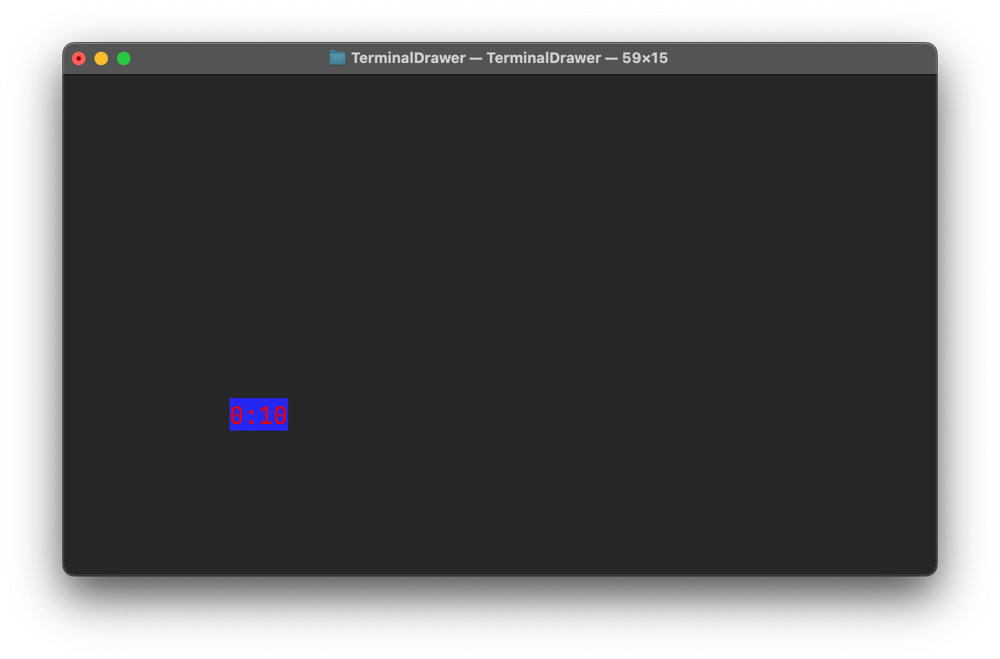

TerminalDrawer offers 2 modes to run in. [**CSV**](#csv-mode) mode and [**Clock**](#clock-mode) mode.

---

## CSV Mode

The CSV mode allow you to draw points in the terminal from a CSV file.

For example, the following file will draw a simple point at the column 10, row 10, with the **name**(what the program should draw at the coordinates provided).

```csv
10, 10, test
```

So in the terminal type:

```zsh
TerminalDrawer --no-start --csv
    #What csv file would you like to use? (*.csv) {enter name of file here}
```


*The status bar was enabled with the `-s` option*

<br>
<br>

## Clock Mode

This mode can be enabled by adding the `--clock` when running the program, or by telling it in the start screen.

It will display a clock that moves similar to the popular [DVD logo animation](https://www.bouncingdvdlogo.com)


